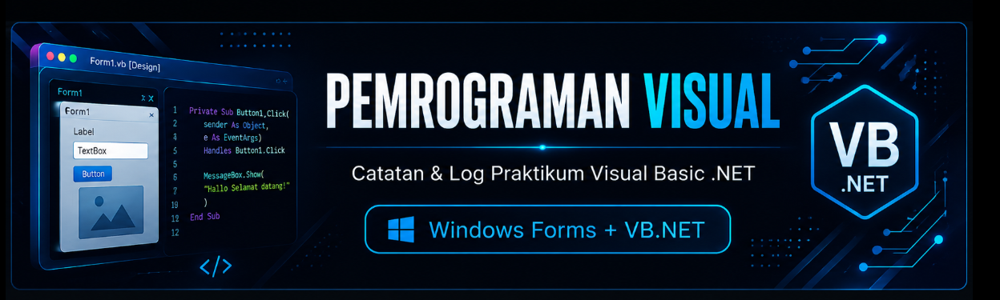

<p align="center">
  
</p>

<p align="center">
  
  
  
</p>

<p align="center">
  
  
  
  
</p>

<p align="center">
  
</p>

---

# 🖥️ Pemrograman Visual

Repository ini berisi **catatan materi, dokumentasi, source code, dan hasil praktikum** mata kuliah **Pemrograman Visual** menggunakan **Visual Studio, .NET, Windows Forms, dan Visual Basic .NET (VB.NET)**.

Setiap pertemuan dikelompokkan ke dalam folder project masing-masing agar lebih mudah dipelajari, dijalankan, dan dikembangkan kembali melalui Visual Studio.

---

## 👨‍🎓 Identitas

<p align="center">

|    🧑‍🎓 Nama    |     🆔 NIM    |  🏷️ Kelas |
| :--------------: | :-----------: | :--------: |
| **Fathul Khair** | **241712073** | **KOM B2** |

</p>

---

## 🛠️ Teknologi yang Digunakan

<p align="center">


</p>

---

# 📑 Daftar Isi

* [Tentang Repository](#-tentang-repository)
* [Pertemuan 1 — Pengantar Pemrograman Visual](#-pertemuan-1--pengantar-pemrograman-visual)

  * [Konsep Dasar Visual Programming](#konsep-dasar-visual-programming)
  * [Karakteristik dan Paradigma](#karakteristik-dan-paradigma)
  * [Kelebihan dan Keterbatasan](#kelebihan-dan-keterbatasan)
  * [Ekosistem dan Platform](#ekosistem-dan-platform)
  * [Instalasi Visual Studio](#instalasi-visual-studio)
* [Pertemuan 2 — Komponen Visual dan Event Handling](#-pertemuan-2--komponen-visual-dan-event-handling)

  * [Konsep GUI](#konsep-gui)
  * [Komponen dan Naming Convention](#komponen-dan-naming-convention)
  * [Properti Esensial](#properti-esensial)
  * [Event-Driven Programming](#event-driven-programming)
  * [Project Profil Mahasiswa](#project-profil-mahasiswa)
  * [Alur Program](#alur-program)
  * [Contoh Kode](#contoh-kode)
* [Pertemuan 3 — Operator dan Struktur Kendali](#-pertemuan-3--operator-dan-struktur-kendali)

  * [Deskripsi Program](#deskripsi-program)
  * [Kontrol yang Digunakan](#kontrol-yang-digunakan)
  * [Alur Logika](#alur-logika)
  * [Validasi Input](#validasi-input)
  * [Percabangan Nilai](#percabangan-nilai)
  * [Contoh Kode](#contoh-kode-1)
* [Cara Menjalankan Project](#-cara-menjalankan-project)
* [Shortcut Visual Studio](#-shortcut-visual-studio)

---

# 📚 Tentang Repository

Repository ini dibuat sebagai dokumentasi perkembangan pembelajaran mata kuliah **Pemrograman Visual**.

Materi dan implementasi yang dipelajari meliputi:

* 🎨 Visual Programming
* 🖥️ Graphical User Interface (GUI)
* 🧩 Windows Forms
* ⚡ Event-Driven Programming
* 📝 TextBox, Label, Button, PictureBox
* 🔀 Operator dan struktur percabangan
* ✅ Validasi input
* 🛠️ Pengembangan aplikasi menggunakan Visual Studio

---

# 📘 Pertemuan 1 — Pengantar Pemrograman Visual


## Konsep Dasar Visual Programming

**Visual Programming** adalah pendekatan pengembangan perangkat lunak yang memanfaatkan elemen-elemen grafis seperti ikon, blok, diagram, form, dan kontrol antarmuka untuk menyusun logika serta alur program.

Pendekatan ini membantu programmer, terutama pemula, memahami hubungan antara tampilan aplikasi dengan kode yang digunakan.

---

## Karakteristik dan Paradigma

| Karakteristik                       | Penjelasan                                                                                           |
| ----------------------------------- | ---------------------------------------------------------------------------------------------------- |
| 🎨 **Visual & Diagrammatic**        | Logika dan tampilan aplikasi dapat direpresentasikan melalui elemen visual.                          |
| ⚡ **Rapid Application Development** | Pembuatan prototipe UI menjadi lebih cepat menggunakan pendekatan drag-and-drop.                     |
| 🖼️ **WYSIWYG**                     | Tampilan yang dirancang pada Design View dapat langsung dilihat hasilnya ketika aplikasi dijalankan. |
| 🔁 **Feedback Instan**              | Perubahan tampilan maupun kode dapat langsung diuji melalui IDE.                                     |

---

## Kelebihan dan Keterbatasan

| ✅ Kelebihan                                | ⚠️ Keterbatasan                                               |
| ------------------------------------------ | ------------------------------------------------------------- |
| Memudahkan pemula memahami logika program. | Kurang fleksibel untuk pemrograman level rendah.              |
| Mempercepat pembuatan antarmuka.           | Memiliki ketergantungan terhadap IDE atau ekosistem tertentu. |
| Mengurangi kesalahan saat merancang UI.    | Membutuhkan resource dan runtime tertentu.                    |

---

## Ekosistem dan Platform

| Platform                   | Target        | Karakteristik                                        |
| -------------------------- | ------------- | ---------------------------------------------------- |
| **Scratch**                | Web / Edukasi | Visual block programming untuk belajar logika dasar. |
| **MIT App Inventor**       | Android       | Block programming untuk aplikasi mobile.             |
| **Visual Studio + VB.NET** | Desktop       | Pengembangan aplikasi GUI berbasis Windows Forms.    |
| **JavaFX + Scene Builder** | Desktop       | Perancangan UI menggunakan FXML dan Java.            |

---

## Instalasi Visual Studio

1. Download **Visual Studio Community**.
2. Buka **Visual Studio Installer**.
3. Pilih workload:

   * `.NET Desktop Development`
4. Pastikan komponen pendukung Visual Basic dan .NET tersedia.
5. Klik **Install / Modify**.
6. Setelah instalasi selesai, buka Visual Studio dan buat project Windows Forms.

---

# 🧩 Pertemuan 2 — Komponen Visual dan Event Handling


## Konsep GUI

**Graphical User Interface (GUI)** merupakan antarmuka yang memungkinkan pengguna berinteraksi dengan aplikasi melalui komponen visual seperti tombol, kotak teks, label, dan form.

Pada Windows Forms, **Form** berfungsi sebagai wadah utama untuk menempatkan berbagai kontrol.

---

## Komponen dan Naming Convention

Penggunaan prefix membantu membuat kode lebih mudah dibaca.

| Komponen   | Prefix | Fungsi                                 |
| ---------- | ------ | -------------------------------------- |
| Form       | `frm`  | Jendela utama aplikasi.                |
| Label      | `lbl`  | Menampilkan informasi atau keterangan. |
| TextBox    | `txt`  | Menerima input pengguna.               |
| Button     | `btn`  | Menjalankan aksi ketika diklik.        |
| PictureBox | `pic`  | Menampilkan gambar.                    |

---

## Properti Esensial

| Properti        | Fungsi                                   |
| --------------- | ---------------------------------------- |
| `(Name)`        | Nama kontrol yang digunakan di kode.     |
| `Text`          | Teks yang ditampilkan.                   |
| `StartPosition` | Posisi awal Form.                        |
| `BackColor`     | Warna latar belakang.                    |
| `ForeColor`     | Warna teks.                              |
| `Font`          | Jenis dan ukuran tulisan.                |
| `Enabled`       | Mengatur apakah kontrol dapat digunakan. |
| `Visible`       | Mengatur apakah kontrol terlihat.        |

---

## Event-Driven Programming

Windows Forms menggunakan konsep **Event-Driven Programming**.

Program tidak hanya berjalan dari atas ke bawah, tetapi menunggu suatu kejadian atau **event**, kemudian menjalankan kode yang berkaitan dengan event tersebut.

Contohnya:

```text
Pengguna
   │
   ▼
Klik Button
   │
   ▼
Event Handler
   │
   ▼
Kode VB.NET dijalankan
   │
   ▼
Output ditampilkan
```

Event yang umum digunakan:

* `Click`
* `TextChanged`
* `KeyPress`
* `MouseEnter`
* `Form_Load`

---

## Project Profil Mahasiswa

Pada pertemuan ini dibuat aplikasi sederhana **Profil Mahasiswa**.

Aplikasi menggunakan:

| Kontrol | Nama           | Fungsi               |
| ------- | -------------- | -------------------- |
| Label   | `LabelNama`    | Keterangan nama      |
| Label   | `LabelNIM`     | Keterangan NIM       |
| Label   | `LabelKOM`     | Keterangan kelas/KOM |
| TextBox | `TxtNama`      | Input nama           |
| TextBox | `TxtNIM`       | Input NIM            |
| TextBox | `TxtKOM`       | Input KOM            |
| Button  | `BtnTampilkan` | Menampilkan data     |
| Button  | `BtnHapus`     | Menghapus data       |
| Button  | `BtnKeluar`    | Menutup aplikasi     |

---

## Alur Program

1. Pengguna memasukkan nama.
2. Pengguna memasukkan NIM.
3. Pengguna memasukkan KOM.
4. Klik **Tampilkan**.
5. Data ditampilkan menggunakan `MessageBox`.
6. Tombol **Hapus** digunakan untuk mengosongkan input.
7. Tombol **Keluar** digunakan untuk menutup aplikasi.

---

## Contoh Kode

```vb
Private Sub BtnTampilkan_Click(sender As Object, e As EventArgs) Handles BtnTampilkan.Click

    MessageBox.Show(
        "Hallo Selamat datang!" & vbCrLf &
        "Nama : " & TxtNama.Text & vbCrLf &
        "NIM : " & TxtNIM.Text & vbCrLf &
        "KOM : " & TxtKOM.Text
    )

End Sub

Private Sub BtnHapus_Click(sender As Object, e As EventArgs) Handles BtnHapus.Click

    TxtNama.Clear()
    TxtNIM.Clear()
    TxtKOM.Clear()

End Sub

Private Sub BtnKeluar_Click(sender As Object, e As EventArgs) Handles BtnKeluar.Click

    Me.Close()

End Sub
```

### Sintaks yang digunakan

| Sintaks             | Kegunaan                   |
| ------------------- | -------------------------- |
| `MessageBox.Show()` | Menampilkan pesan/dialog.  |
| `&`                 | Menggabungkan teks/string. |
| `vbCrLf`            | Membuat baris baru.        |
| `.Clear()`          | Menghapus isi TextBox.     |
| `Me.Close()`        | Menutup Form/aplikasi.     |

---

# 🔀 Pertemuan 3 — Operator dan Struktur Kendali


## Deskripsi Program

Pada pertemuan ini dibuat program yang menggunakan **operator, validasi input, dan struktur percabangan `If...ElseIf...Else`**.

Program menerima **nilai ujian** dari pengguna kemudian menentukan gambar yang ditampilkan pada `PictureBox` berdasarkan rentang nilai.

---

## Kontrol yang Digunakan

| Kontrol    | Nama       | Fungsi                                |
| ---------- | ---------- | ------------------------------------- |
| TextBox    | `txtNilai` | Input nilai ujian.                    |
| Button     | `btnInput` | Memproses nilai.                      |
| PictureBox | `picImage` | Menampilkan gambar berdasarkan nilai. |

---

## Alur Logika

```text
          Mulai
            │
            ▼
     Masukkan nilai
            │
            ▼
    Validasi input angka
            │
       ┌────┴────┐
       │         │
     Tidak       Ya
       │         │
       ▼         ▼
   Tampilkan   Cek nilai
    pesan         │
                  ▼
        ┌─────────┼─────────┐
        │         │         │
      ≤ 50     51–75       >75
        │         │         │
        ▼         ▼         ▼
   gambar1    gambar2    gambar3
        │         │         │
        └─────────┼─────────┘
                  ▼
                Selesai
```

---

## Validasi Input

Program menggunakan:

```vb
Integer.TryParse()
```

untuk memastikan nilai yang dimasukkan dapat dikonversi menjadi bilangan integer.

Selain itu, nilai harus berada pada rentang:

```text
0 sampai 100
```

Jika nilai di luar rentang tersebut, program akan memberikan peringatan.

---

## Percabangan Nilai

| Rentang Nilai | Gambar         |
| ------------: | -------------- |
|      `0 – 50` | `gambar1.jpeg` |
|     `51 – 75` | `gambar2.jpeg` |
|    `76 – 100` | `gambar3.jpeg` |

---

## Contoh Kode

```vb
Private Sub btnInput_Click(sender As Object, e As EventArgs) Handles btnInput.Click

    Dim nilaiUjian As Integer

    If Not Integer.TryParse(txtNilai.Text, nilaiUjian) Then

        MessageBox.Show("Masukkan dalam bentuk angka")
        txtNilai.Focus()
        Return

    End If

    If nilaiUjian < 0 OrElse nilaiUjian > 100 Then

        MessageBox.Show("Masukkan nilai 0 - 100")
        txtNilai.Focus()
        Return

    End If

    If nilaiUjian <= 50 Then

        picImage.Image = Image.FromFile("Assets\gambar1.jpeg")

    ElseIf nilaiUjian <= 75 Then

        picImage.Image = Image.FromFile("Assets\gambar2.jpeg")

    Else

        picImage.Image = Image.FromFile("Assets\gambar3.jpeg")

    End If

End Sub

Private Sub txtNilai_KeyPress(sender As Object, e As KeyPressEventArgs) Handles txtNilai.KeyPress

    If Not Char.IsControl(e.KeyChar) AndAlso Not Char.IsDigit(e.KeyChar) Then

        e.Handled = True

    End If

End Sub
```

---

## 📁 Struktur Folder

Struktur repository yang disarankan:

```text
Pemrograman-Visual/
│
├── README.md
│
├── pertemuan2-komponen-visual/
│   ├── pertemuan2-komponen-visual.slnx
│   └── ...
│
├── Pertemuan3-Operator-Struktur-Kendali/
│   ├── Pertemuan3-Operator-Struktur-Kendali.slnx
│   ├── Assets/
│   │   ├── gambar1.jpeg
│   │   ├── gambar2.jpeg
│   │   └── gambar3.jpeg
│   └── ...
│
└── ...
```

> **Catatan:** Folder `Assets` harus ikut tersedia ketika aplikasi dijalankan karena program mengambil gambar menggunakan path `Assets\gambar1.jpeg`, `gambar2.jpeg`, dan `gambar3.jpeg`.

---

# ▶️ Cara Menjalankan Project

### 1. Clone Repository

Clone repository menggunakan Git:

```bash
git clone <URL-REPOSITORY>
```

### 2. Masuk ke Folder Project

Contoh:

```bash
cd Pemrograman-Visual
```

### 3. Buka Project

Buka file `.slnx` atau `.sln` menggunakan **Visual Studio**.

### 4. Jalankan Program

Tekan:

```text
F5
```

atau klik tombol **Start** pada Visual Studio.

---

# ⌨️ Shortcut Visual Studio

| Shortcut             | Fungsi                                 |
| -------------------- | -------------------------------------- |
| `F5`                 | Menjalankan aplikasi / Start Debugging |
| `Shift + F5`         | Menghentikan debugging                 |
| `F4`                 | Membuka Properties Window              |
| `F7`                 | Membuka Code View                      |
| `Shift + F7`         | Membuka Design View                    |
| `Ctrl + Shift + B`   | Build Solution                         |
| `Ctrl + K, Ctrl + D` | Merapikan/format kode                  |

---

# 📌 Progress Praktikum

| Pertemuan | Materi                                           |      Status      |
| :-------: | ------------------------------------------------ | :--------------: |
|     01    | Pengantar Pemrograman Visual & Setup Environment |     ✅ Selesai    |
|     02    | Komponen Visual & Event Handling                 |     ✅ Selesai    |
|     03    | Operator & Struktur Kendali                      |     ✅ Selesai    |
|     04    | —                                                | ⏳ Belum tersedia |
|     05    | —                                                | ⏳ Belum tersedia |

---

## 🚀 Pengembangan Selanjutnya

Repository ini akan terus diperbarui seiring bertambahnya materi dan praktikum.

Materi berikutnya akan ditambahkan secara bertahap sehingga repository dapat menjadi **catatan pembelajaran sekaligus dokumentasi project Pemrograman Visual**.

---

<p align="center">
  
  
</p>

<p align="center">

**Pemrograman Visual — D3 Teknik Informatika**

**Universitas Sumatera Utara**

</p>

<p align="center">
  
</p>
